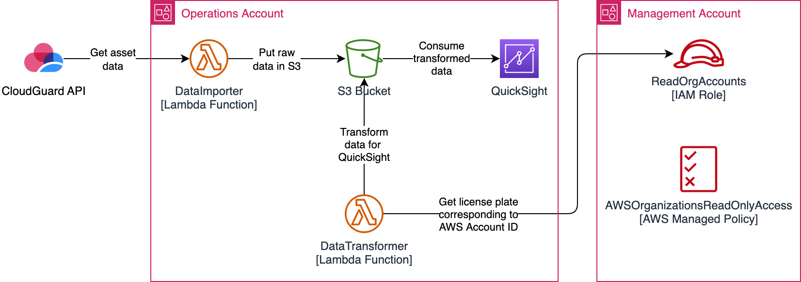

# cspm-to-aws-s3-for-quicksight
Transfers data out of CheckPoint CSPM over to AWS S3 for display as time series data in Quicksight. At a high level, the solution comprises multiple Lambda functions that perform the following:

1. Obtain all AWS ECF asset data in CloudGuard CSPM via API calls to the endpoint: `https://api.cace1.dome9.com/v2/protected-asset/search`
2. Save obtained (raw) data in an S3 bucket
3. Transform raw data into a format that can be consumed by QuickSight for presentation
   1. Raw data does not appear to include the AWS Account name (license plate)
   2. A `listAccounts` call against the AWS Organization is used to get this information

The figure below presents a high level overview of the above steps




# Additional Notes
## Useful Links
1. CloudGuard CSPM API Reference: [Dome9 API](https://api-v2-docs.dome9.com/)
2. AWS NodeJS SDK Getting Started: [Getting started in Node.js](https://docs.aws.amazon.com/sdk-for-javascript/v3/developer-guide/getting-started-nodejs.html)
3. AWS SDK for JavaScript - API Reference: [aws-sdk](https://docs.aws.amazon.com/AWSJavaScriptSDK/latest/index.html)


## Sample response from `listAccounts`. Ref: [listAccounts-property](https://docs.aws.amazon.com/AWSJavaScriptSDK/latest/AWS/Organizations.html#listAccounts-property)
```json
{
    "Accounts": [
        {
            "Id": "123456789123",
            "Arn": "arn:aws:organizations::123456789123:account/o-umk3sness/123456789123",
            "Email": "noob.saibot@umk3.sness.com",
            "Name": "noob.saibot",
            "Status": "ACTIVE",
            "JoinedMethod": "CREATED",
            "JoinedTimestamp": "2021-10-16 15:56:15.433000-07:00"
        },
        {
            "Id": "543216789123",
            "Arn": "arn:aws:organizations::543216789123:account/o-umk3sness/543216789123",
            "Email": "sonya.blade@umk3.sness.com",
            "Name": "sonya.blade",
            "Status": "ACTIVE",
            "JoinedMethod": "CREATED",
            "JoinedTimestamp": "2021-10-16 20:10:11.740000-07:00"
        },
        {
            "Id": "789123543216",
            "Arn": "arn:aws:organizations::789123543216:account/o-umk3sness/789123543216",
            "Email": "unmasked.subzero@umk3.sness.com",
            "Name": "unmasked.subzero",
            "Status": "ACTIVE",
            "JoinedMethod": "INVITED",
            "JoinedTimestamp": "2021-10-16 15:25:35.204000-07:00"
        }
    ],
    "ResponseMetadata": {
        "RequestId": "13556525-ccf5-455f-b41c-732cb9b34e33",
        "HTTPStatusCode": 200,
        "HTTPHeaders": {
            "x-amzn-requestid": "13556525-ccf5-455f-b41c-732cb9b34e33",
            "content-type": "application/x-amz-json-1.1",
            "content-length": "735",
            "date": "Wed, 27 Jul 2022 19:29:43 GMT"
        },
        "RetryAttempts": 0
    }
}
```