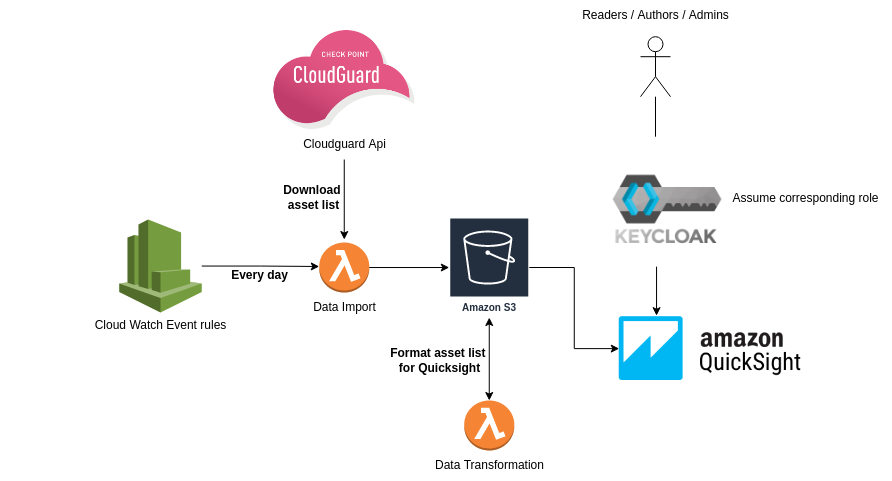

# cspm-to-aws-s3-for-quicksight
This Repository is used to deploy a Dashboard solution for the Cloudguard Protected Assets.
Those Dashboards offer a time series view using AWS Quicksight.

## architecture
It deploys:
- AWS
- - S3 Bucket for the data
- - Importation Lambda
- - Transformation Lambda
- - Quicksight data source
- - Quicksight user management
- - Quicksight groups management  

- Keycloack
- - Create the client roles for AWS
- - groups management

## How to deploy

Quicksight terraform module being still [in progress](https://github.com/hashicorp/terraform-provider-aws/issues/10990) many API action aren't available yet.  
This version of the code integrate as much as possible but many manual action are still left to do.

Please follow this procedure for *new account deployement* until a better integration [terraform ticket](https://github.com/hashicorp/terraform-provider-aws/issues/10990)

    1. Export the necessary variable:
        - AWS credential of the main account
        - AWS Credential of the management account (see variable for more detail)
    
    2. Make sure the Parameter Store entry : `/cloudguard_dashboard/cloudguard_api_keys` is created in the `Operations` account (Example: {"apiKeyId":"<Your_cloudGuard_api_secret>", "apiKeySecret":"<Your_cloudguard_api_secret>"})
        
    3. Terraform apply (on first execution quicksight data source creation will fail.)

    4. Coonect to AWS Quicksight and launch the service for the account:
        - Subscribe to Entreprise
        - Select region:"ca-central-1"
        - Select Authentication Method: "Use IAM federated identities only"
        - Enter a Name: "CSPM-Dashboard" 
        - Enter a notification Email Adress: ""
        - Select IAM Role: "CloudGuardQuicksightserviceRole"
        - Finish

    6. Execute the terraform a second time.

    7. Now the DataSource is created in Quicksight, You can now create a new dataset and use "CSPM Assets list by type and account", and with this dataset create a new analyses.
    Attention: Change the type of account id, Indeed the account id is labelled as a integer but it's a string. You need to change it on the data prview.  
    Also, you need to add the shceduled refresh for Quicksight to import the new data everyday.

    8. **BEWARE** On the first execution the Dashboard must be link with the Authors and Admins groups. <Dashboard> -> <Share> -> <select "authors" and "admin">

## Please note
The CSPM API provide a greater list of assets than the Web UI. A filter has been created in Quicksight to render the same view.

Here is the list of assets not refderenced in CSPM:
- IAM policy
- Subnet
- Security group
- NACL
- event rule
- IAM Account summary 
- VPC flowlog 
- metric alarm 
- ?? Internet Gateway
- EIP 
- AMI
- sns subscription
- auto scaling group
- elastic cache
- VPC Peering connection
